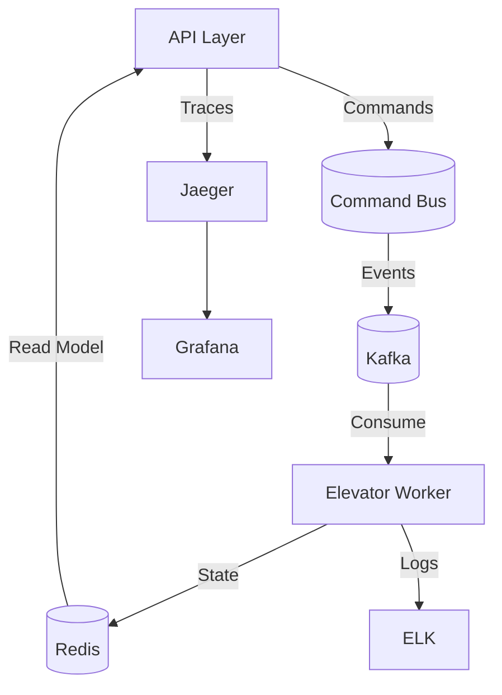

# Elevator API Documentation

## Overview

The Elevator API is a scalable, real-time elevator management system built with the [NestJS](https://nestjs.com/) framework, designed to meet the requirements of the Beem Tech Challenge. It implements a Command Query Responsibility Segregation (CQRS) architecture with an event-driven design to manage elevator operations, track real-time statuses, and log events. The system supports asynchronous movement for multiple elevators, configurable building floors, and precise timing for movement (1 floor every 5 seconds) and door operations (2 seconds). It integrates with:

- **PostgreSQL**: Persists elevator data and event logs with query tracking using TypeORM with UUIDs.
- **Redis**: Manages real-time elevator states on port 6380.
- **Kafka**: Streams events for asynchronous processing.
- **WebSocket**: Delivers real-time updates to clients.
- **BullMQ**: Processes elevator movement jobs asynchronously.
- **Docker**: Ensures consistent deployment across environments.

This documentation provides detailed instructions for installation, testing, and deployment, along with endpoint descriptions and architectural details, tailored for developers working on the Beem Tech Challenge.

---

## Table of Contents

1. [Beem Tech Challenge Requirements](#beem-tech-challenge-requirements)
2. [Architecture](#architecture)
3. [Technologies](#technologies)
4. [Project Setup](#project-setup)
5. [API Endpoints](#api-endpoints)
6. [WebSocket Events](#websocket-events)
7. [Testing](#testing)
8. [Deployment](#deployment)
9. [Resources](#resources)
10. [Support](#support)
11. [License](#license)

---

## Beem Tech Challenge Requirements

The Elevator API fulfills the Beem Tech Challenge Task 1 requirements as follows:

- **Endpoints**:
  - `POST /api/elevators/call`: Calls an elevator from any floor to any other floor.
  - `GET /api/elevators/:id/status`: Retrieves real-time elevator place, state, and direction.
  - Additional endpoints (`POST /api/elevators/initialize`, `GET /api/elevators`, `GET /api/elevators/:id/logs`) enhance functionality.
- **Real-Time Logging**:
  - Events (e.g., `CALLED`, `MOVING`, `ARRIVED`) are logged to PostgreSQL via `ElevatorEventEntity`.
  - SQL queries are tracked using `QueryTrackingInterceptor` and stored in the database.
- **Asynchronous Movement**:
  - Supports up to `MAX_ELEVATORS` (default: 5) moving independently, with states updated in Redis and events streamed via Kafka.
  - Logs are segregated by elevator ID, place (floor), state, and direction, accessible via `GET /api/elevators/:id/logs`.
- **Real-Time Monitoring**:
  - WebSocket (`/elevators` namespace) broadcasts updates for elevator states, movements, arrivals, door operations, errors, and emergency stops.
- **Configuration**:
  - Building floors are configurable via `BUILDING_FLOORS` (default: 10) in `.env`.
  - Elevator movement takes 5 seconds per floor (`MOVE_TIMER_PER_FLOOR=5000`).
  - Door open/close operations take 2 seconds (`DOOR_OPERATION_TIME=2000`).
- **Deliverables**:
  - API endpoints implemented in TypeScript with NestJS.
  - Unit tests written with Jest, covering `ElevatorGateway`, `ElevatorMovementQueue`, and `MovementProcessor`.
  - Comprehensive installation and testing instructions provided below.
  - Code repository available at [insert GitHub/Bitbucket/GitLab link here].

---

## Architecture

The Elevator API uses a CQRS and event-driven architecture, with components interacting as follows:



- **API Layer**: Handles HTTP (`ElevatorController`) and WebSocket (`ElevatorGateway`) requests, dispatching commands and queries via CQRS.
- **CQRS**: Separates write (`CallElevatorCommand`, `InitializeElevatorCommand`) and read (`GetElevatorStatusQuery`, `GetAllElevatorsQuery`, `GetElevatorLogsQuery`) operations using `@nestjs/cqrs`.
- **Kafka**: Streams events (e.g., `ElevatorCalled`, `ElevatorArrived`) for asynchronous processing via `KafkaProducerAdapter`.
- **Elevator Worker**: Processes movement jobs via `MovementProcessor` using BullMQ, updating states in Redis.
- **Redis**: Stores real-time elevator states (e.g., `currentFloor`, `direction`) on port 6380.
- **PostgreSQL**: Persists elevator data (`ElevatorEntity`) and event logs (`ElevatorEventEntity`) with query tracking.
- **Jaeger/Grafana**: Provides tracing and visualization (optional, not fully implemented).
- **ELK**: Centralizes logs for debugging (optional, not fully implemented).

---

## Technologies

- **Framework**: NestJS (TypeScript)
- **Database**: PostgreSQL (TypeORM with UUIDs)
- **State Management**: Redis (port 6380)
- **Message Broker**: Kafka (SASL-disabled for local development)
- **Queue**: BullMQ (for elevator movement jobs)
- **WebSocket**: Socket.IO (for real-time updates)
- **Containerization**: Docker
- **Package Manager**: pnpm
- **Testing**: Jest
- **API Documentation**: Swagger (`@nestjs/swagger`)

---

## Project Setup

### Prerequisites

- **Node.js**: v18 or higher
- **pnpm**: Install globally with `npm install -g pnpm`
- **Docker and Docker Compose**: For running PostgreSQL, Redis, and Kafka
- **Git**: For cloning the repository

### Environment Variables

Create a `.env` file in the project root with the following configuration:

```env
NODE_ENV=development
PORT=3000
LOG_LEVEL=info
LOG_DIRECTORY=/app/logs
ALLOWED_ORIGINS=http://localhost:3000

# Database
DB_HOST=localhost
DB_PORT=5435
DB_NAME=elevator_db
DB_USERNAME=elevator_user
DB_PASSWORD=elevator_pass
DB_LOGGING=true

# Test Database
TEST_DB_HOST=localhost
TEST_DB_PORT=5435
TEST_DB_NAME=elevator_test_db
TEST_DB_USERNAME=elevator_user
TEST_DB_PASSWORD=elevator_pass

# Redis
REDIS_HOST=localhost
REDIS_PORT=6380
REDIS_DB=0

# Kafka
KAFKA_BROKERS=localhost:9092
KAFKA_SSL=false
KAFKAJS_NO_PARTITIONER_WARNING=1

# Elevator Configuration
BUILDING_FLOORS=10
MOVE_TIMER_PER_FLOOR=5000
DOOR_OPERATION_TIME=2000
MAX_ELEVATORS=5
```

### Installation

1. **Clone the Repository**:

   ```bash
   git clone <repository-url>
   cd elevator-api
   ```

2. **Install Dependencies**:

   ```bash
   pnpm install
   ```

3. **Start Dependencies**:
   Use Docker Compose to start PostgreSQL, Redis, and Kafka:

   ```bash
   docker-compose up -d
   ```

   Example `docker-compose.yml` (SASL-disabled to resolve `container elevator-api-node-kafka-1 exited (1)`):

   ```yaml
   version: '3.8'
   services:
     postgres:
       image: postgres:14
       environment:
         POSTGRES_DB: ${DB_NAME:-elevator_db}
         POSTGRES_USER: ${DB_USERNAME:-elevator_user}
         POSTGRES_PASSWORD: ${DB_PASSWORD:-elevator_pass}
       ports:
         - '${DB_PORT:-5435}:5432'
       volumes:
         - postgres_data:/var/lib/postgresql/data
       healthcheck:
         test: ['CMD', 'pg_isready', '-U', '${DB_USERNAME:-elevator_user}']
         interval: 10s
         timeout: 5s
         retries: 5
       networks:
         - elevator-network

     redis:
       image: redis:7
       ports:
         - '${REDIS_PORT:-6380}:6379'
       volumes:
         - redis_data:/data
       healthcheck:
         test: ['CMD', 'redis-cli', 'ping']
         interval: 10s
         timeout: 5s
         retries: 5
       networks:
         - elevator-network

     zookeeper:
       image: confluentinc/cp-zookeeper:7.3.0
       environment:
         ZOOKEEPER_CLIENT_PORT: 2181
         ZOOKEEPER_TICK_TIME: 2000
       ports:
         - '2181:2181'
       networks:
         - elevator-network
       healthcheck:
         test: ['CMD', 'bash', '-c', 'echo ruok | nc 127.0.0.1 2181']
         interval: 10s
         timeout: 5s
         retries: 10
         start_period: 30s

     kafka:
       image: confluentinc/cp-kafka:7.3.0
       depends_on:
         zookeeper:
           condition: service_healthy
       ports:
         - '${KAFKA_PORT:-9092}:9092'
       environment:
         KAFKA_BROKER_ID: 1
         KAFKA_ZOOKEEPER_CONNECT: zookeeper:2181
         KAFKA_ADVERTISED_LISTENERS: PLAINTEXT://${KAFKA_BROKERS:-kafka:9092}
         KAFKA_OFFSETS_TOPIC_REPLICATION_FACTOR: 1
         KAFKA_GROUP_INITIAL_REBALANCE_DELAY_MS: 0
         KAFKA_NUM_PARTITIONS: 3
         KAFKA_DEFAULT_REPLICATION_FACTOR: 1
       networks:
         - elevator-network
       healthcheck:
         test:
           [
             'CMD',
             'kafka-broker-api-versions',
             '--bootstrap-server',
             'kafka:9092',
           ]
         interval: 10s
         timeout: 5s
         retries: 10
         start_period: 30s

   volumes:
     postgres_data:
     redis_data:

   networks:
     elevator-network:
       driver: bridge
   ```

### Running the Application

1. **Development**:

   ```bash
   pnpm run start:dev
   ```

2. **Production**:
   ```bash
   pnpm run build
   pnpm run start:prod
   ```

The API will be available at `http://localhost:3000` (or the port specified in `PORT`).

---

## API Endpoints

The Elevator API provides the following REST endpoints under `/api/elevators`, documented with Swagger (`@nestjs/swagger`). The core endpoints required by the Beem Tech Challenge are `POST /api/elevators/call` and `GET /api/elevators/:id/status`, with additional endpoints for enhanced functionality.

### 1. Call Elevator

- **Endpoint**: `POST /api/elevators/call`
- **Summary**: Calls an elevator from any floor to any other floor within the configured `BUILDING_FLOORS` (default: 10). Triggers asynchronous movement processed by `MovementProcessor`.
- **Body**:
  ```typescript
  interface CallElevatorDto {
    fromFloor: number; // Starting floor (0 to BUILDING_FLOORS)
    toFloor: number; // Destination floor (0 to BUILDING_FLOORS)
    userId: string; // UUID of the user making the call
  }
  ```
- **Response**:
  ```json
  {
    "success": true,
    "elevatorId": "uuid-123",
    "message": "Elevator uuid-123 called from floor 2 to 5"
  }
  ```
- **Status Codes**:
  - `200`: Elevator called successfully.
  - `400`: Invalid input (e.g., floors outside `BUILDING_FLOORS`, same `fromFloor` and `toFloor`).
- **Example**:
  ```bash
  curl -X POST http://localhost:3000/api/elevators/call \
    -H "Content-Type: application/json" \
    -d '{"fromFloor": 2, "toFloor": 5, "userId": "user-uuid-123"}'
  ```

### 2. Get Elevator Status

- **Endpoint**: `GET /api/elevators/:id/status`
- **Summary**: Retrieves real-time information about an elevator’s place (`currentFloor`), state (e.g., `IDLE`, `MOVING`, `DOORS_OPENING`), and direction (e.g., `UP`, `DOWN`, `IDLE`) from Redis.
- **Parameters**:
  - `id`: Elevator UUID (path parameter).
- **Response**:
  ```typescript
  interface ElevatorStatusDto {
    elevatorId: string; // UUID
    currentFloor: number; // Current floor (0 to BUILDING_FLOORS)
    state: string; // e.g., "IDLE", "MOVING", "DOORS_OPENING", "DOORS_CLOSING", "MAINTENANCE"
    direction: string; // e.g., "UP", "DOWN", "IDLE"
    targetFloor?: number; // Destination floor, if moving
    lastUpdated: string; // ISO timestamp
  }
  ```
- **Status Codes**:
  - `200`: Status retrieved successfully.
  - `404`: Elevator not found.
- **Example**:
  ```bash
  curl http://localhost:3000/api/elevators/uuid-123/status
  ```

### Additional Endpoints

The following endpoints enhance the API beyond the minimum requirements:

3. **Initialize Elevator**
   - **Endpoint**: `POST /api/elevators/initialize`
   - **Summary**: Initializes a new elevator at a specified or default floor (0), up to `MAX_ELEVATORS` (default: 5).
   - **Body**:
     ```typescript
     interface InitializeElevatorDto {
       initialFloor?: number; // Optional starting floor (defaults to 0)
     }
     ```
   - **Response**:
     ```json
     {
       "success": true,
       "elevatorId": "uuid-123",
       "message": "Elevator uuid-123 initialized at floor 0"
     }
     ```
   - **Status Codes**:
     - `201`: Elevator initialized successfully.
     - `400`: Invalid input (e.g., negative floor, exceeding `MAX_ELEVATORS`).
   - **Example**:
     ```bash
     curl -X POST http://localhost:3000/api/elevators/initialize \
       -H "Content-Type: application/json" \
       -d '{"initialFloor": 1}'
     ```

4. **Get All Elevators Status**
   - **Endpoint**: `GET /api/elevators`
   - **Summary**: Retrieves the real-time status of all elevators.
   - **Response**:
     ```typescript
     ElevatorStatusDto[];
     ```
   - **Status Codes**:
     - `200`: Statuses retrieved successfully.
   - **Example**:
     ```bash
     curl http://localhost:3000/api/elevators
     ```

5. **Get Elevator Logs**
   - **Endpoint**: `GET /api/elevators/:id/logs`
   - **Summary**: Retrieves event logs for a specific elevator (last 24 hours by default), stored in PostgreSQL.
   - **Parameters**:
     - `id`: Elevator UUID (path parameter).
   - **Response**:
     ```typescript
     interface ElevatorLogsDto {
       eventId: string; // UUID
       elevatorId: string; // UUID
       eventType: string; // e.g., "CALLED", "MOVING", "ARRIVED"
       floor?: number; // Associated floor, if applicable
       timestamp: string; // ISO timestamp
     }
     ```
   - **Status Codes**:
     - `200`: Logs retrieved successfully.
     - `404`: Elevator not found.
   - **Example**:
     ```bash
     curl http://localhost:3000/api/elevators/uuid-123/logs
     ```

---

## WebSocket Events

The `ElevatorGateway` (namespace: `/elevators`) provides real-time updates via WebSocket (Socket.IO), enabling clients to monitor elevator movements, states, and events in real time, as required by the Beem Tech Challenge.

### Events

- **elevator-states**:
  - Emitted on client connection, providing the current state of all elevators (up to `MAX_ELEVATORS`).
  - Payload: `ElevatorStatusDto[]`

- **elevator-state**:
  - Emitted when a client subscribes to a specific elevator via `subscribe-elevator`.
  - Payload: `ElevatorStatusDto`

- **elevator-update**:
  - Broadcasts general state updates (e.g., `DOORS_CLOSING`, `IDLE`).
  - Payload:
    ```typescript
    {
      elevatorId: string;
      state: string;
      timestamp: Date;
    }
    ```

- **elevator-movement**:
  - Broadcasts movement updates every 5 seconds per floor (`MOVE_TIMER_PER_FLOOR=5000`).
  - Payload:
    ```typescript
    {
      elevatorId: string;
      currentFloor: number;
      targetFloor: number;
      direction: string;
      isMoving: boolean;
      progress: number; // Percentage of movement completion
      timestamp: Date;
    }
    ```

- **elevator-arrived**:
  - Broadcasts when an elevator reaches its destination.
  - Payload:
    ```typescript
    {
      elevatorId: string;
      currentFloor: number;
      state: string; // e.g., "DOORS_OPENING"
      timestamp: Date;
    }
    ```

- **elevator-doors**:
  - Broadcasts door state changes (2 seconds for open/close, `DOOR_OPERATION_TIME=2000`).
  - Payload:
    ```typescript
    {
      elevatorId: string;
      doorState: string; // e.g., "OPEN", "CLOSED"
      timestamp: Date;
    }
    ```

- **elevator-error**:
  - Broadcasts errors during movement (e.g., Redis failure).
  - Payload:
    ```typescript
    {
      elevatorId: string;
      error: string;
      timestamp: Date;
    }
    ```

- **elevator-emergency-stop**:
  - Broadcasts when an elevator is stopped for maintenance.
  - Payload:
    ```typescript
    {
      elevatorId: string;
      timestamp: Date;
    }
    ```

### Client Subscription

- **subscribe-elevator**:
  - Message: `{ elevatorId: string }`
  - Joins the client to the `elevator-${elevatorId}` room and emits `elevator-state`.

- **unsubscribe-elevator**:
  - Message: `{ elevatorId: string }`
  - Removes the client from the `elevator-${elevatorId}` room.

- **get-elevator-status**:
  - Message: `{ elevatorId: string }`
  - Emits `elevator-status` with the current state.

### Example Client (JavaScript)

```javascript
const socket = io('http://localhost:3000/elevators');
socket.on('connect', () => {
  console.log('Connected to WebSocket');
  socket.emit('subscribe-elevator', { elevatorId: 'uuid-123' });
});
socket.on('elevator-state', (state) => {
  console.log('Elevator state:', state);
});
socket.on('elevator-movement', (data) => {
  console.log('Elevator movement:', data);
});
socket.on('elevator-arrived', (data) => {
  console.log('Elevator arrived:', data);
});
```

---

## Testing

The project includes unit and integration tests using Jest, ensuring robust coverage for the Beem Tech Challenge requirements. Tests validate asynchronous elevator movement, real-time state updates, and event logging.

### Running Tests

1. **Unit Tests**:

   ```bash
   pnpm run test
   ```

2. **End-to-End Tests**:

   ```bash
   pnpm run test:e2e
   ```

3. **Test Coverage**:
   ```bash
   pnpm run test:cov
   ```

### Test Components

- **ElevatorGateway**: Tests WebSocket connections, subscriptions, and real-time broadcasts.
- **ElevatorMovementQueue**: Tests adding movement jobs to the BullMQ queue with retry logic.
- **MovementProcessor**: Tests asynchronous elevator movement, state updates in Redis, and error handling.
  - **Fixed Issue**: Tests updated to expect 6 `redis.hmset` calls to account for the final floor’s `MOVING` state update before `DOORS_OPENING` (see `movement.processor.spec.ts`).
  - Validates movement timing (5 seconds per floor) and door operations (2 seconds).
- **Query Tracking**: Ensures all SQL queries are logged with tracking information (who/where/what) via `QueryTrackingInterceptor`.

### Test Notes

- **Asynchronous Movement**: Tests simulate multiple elevators moving independently, with segregated logs stored in PostgreSQL and real-time updates via WebSocket.
- **Timing**: `MovementProcessor` uses `MOVE_TIMER_PER_FLOOR=5000` (5 seconds per floor) and `DOOR_OPERATION_TIME=2000` (2 seconds for door open/close).
- **Query Tracking**: Tests verify that SQL queries are logged with tracking metadata (handled by `QueryTrackingInterceptor`).

---

## Deployment

### Local Deployment

1. **Build the Application**:

   ```bash
   pnpm run build
   ```

2. **Start Dependencies**:

   ```bash
   docker-compose up -d
   ```

3. **Run the Application**:
   ```bash
   pnpm run start:prod
   ```

### Cloud Deployment with Mau

Deploy to AWS using [NestJS Mau](https://mau.nestjs.com):

1. Install Mau CLI:

   ```bash
   pnpm install -g mau
   ```

2. Deploy:
   ```bash
   mau deploy
   ```

Follow the prompts to configure AWS. Mau handles containerization, scaling, and load balancing.

---

## Resources

- **Repository**: [Insert GitHub/Bitbucket/GitLab link here]
- **NestJS Documentation**: [https://docs.nestjs.com](https://docs.nestjs.com)
- **NestJS Discord**: [https://discord.gg/G7Qnnhy](https://discord.gg/G7Qnnhy)
- **NestJS Mau**: [https://mau.nestjs.com](https://mau.nestjs.com)

---

---

## License

The Elevator API is [MIT licensed](https://github.com/nestjs/nest/blob/master/LICENSE).

---
